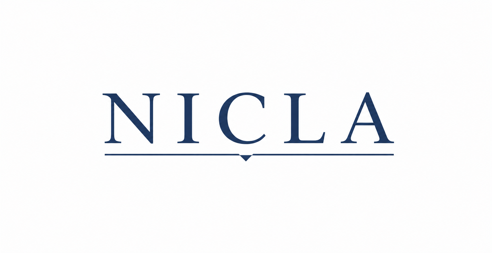

:::{style="text-align: center; margin-bottom: 1rem;"}
{width=600px}
:::

:::{style="font-size: 1.1em; max-width: 800px; margin: 0 auto; padding: 1rem 1rem;"}

Welcome to the website of the **NICLA** group \
(**N**europsychology: **I**nnovative concepts for **C**linical **A**ssessment and rehabilitation)

## Who we are
We are a group of people (from Academia and Healthcare), who meet informally to discuss and share ideas about neuropsychology, with a focus on clinical assessment and rehabilitation. We are mostly (but not only) based in Padova, Italy.

## How to join 
Send an e-mail to [Giulia Sebastianutto](mailto:giulia.sebastianutto@phd.unipd.it) and ask to join our meetings

## Our meetings
Our meetings are held every 2-3 months, and are open to anyone interested in neuropsychology, clinical assessment, and rehabilitation. They are usually held in Padova, at the spaces of University of Padova.
:::

## Recent Posts
Check out the latest &nbsp;[Papers](posts.qmd#category=paper)&nbsp;, &nbsp;[News](posts.qmd#category=news)&nbsp;, &nbsp;[Events](posts.qmd#category=event)&nbsp;, and &nbsp;[More »](/posts.qmd)

:::{#recent-posts}
:::

[All Posts »](/posts.qmd)
